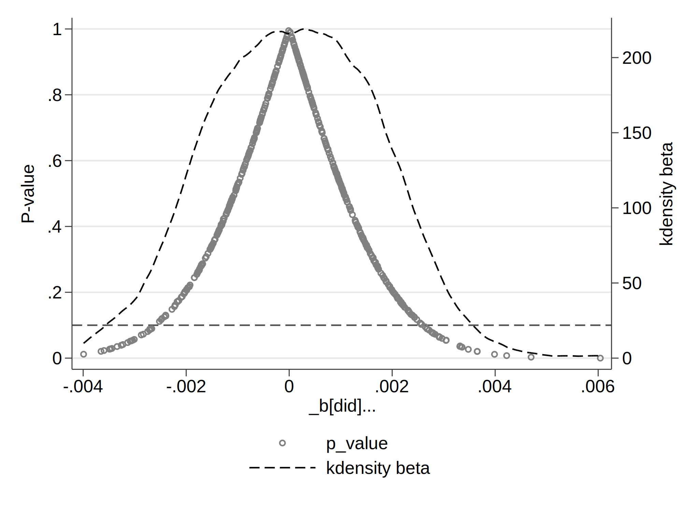
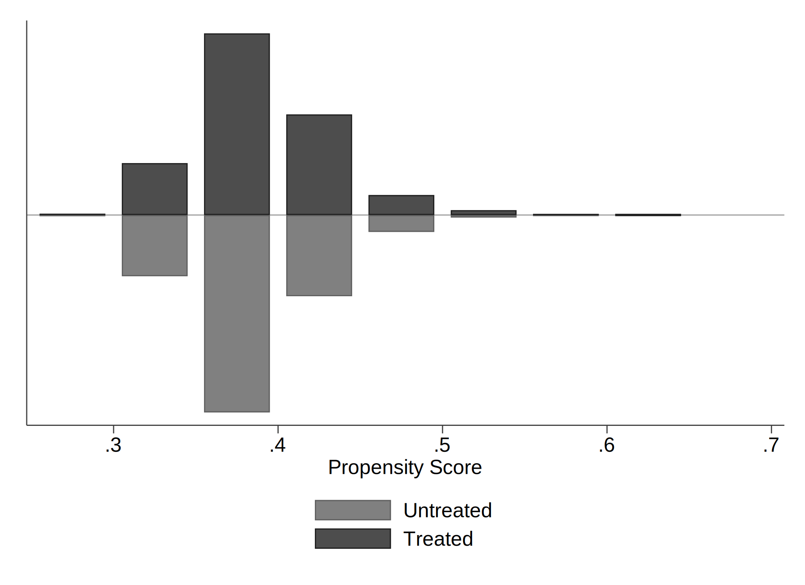

# 🌱 Green Finance Reform and Corporate Green Transformation

This repository contains the empirical analysis for evaluating the policy impact of **China's Green Finance Reform and Innovation Pilot Zones** on corporate green transformation. The project applies econometric methods (multi-period DID, mediation, moderation) using firm-level panel data.

---

## 📖 Introduction

Green finance has emerged as a critical instrument to promote sustainable development. In 2017, China launched **Green Finance Reform and Innovation Pilot Zones**, aiming to integrate environmental objectives into financial systems.  

This project investigates whether and how these pilot zone policies promote firms’ **green transformation**. The study provides evidence on the policy's effectiveness, explores the **mechanisms of influence** (such as R&D investment), and analyzes **heterogeneity across ownership types, industries, and regions**.  

The findings contribute to the understanding of how financial reforms can accelerate corporate sustainability in emerging markets.

---

## ⚙️ Methodology

The empirical strategy is built on a **multi-period Difference-in-Differences (DID)** framework, exploiting the staggered rollout of pilot zones as a quasi-natural experiment.  

- **Baseline analysis**: Multi-period DID with firm and time fixed effects to capture the net policy effect.  
- **Mediation analysis**: Tests whether increased R&D investment serves as a transmission channel.  
- **Moderation analysis**: Explores how digitalization and financing constraints shape the policy’s effectiveness.  
- **Robustness checks**: Parallel trend test, placebo test, lag structure, PSM-DID, and alternative dependent variables.  

This combination ensures rigorous identification of causal effects and robustness of results.

---

## 🔑 Key Findings

1. **Policy Effectiveness**: The pilot zone policy significantly promotes corporate green transformation, improving firms’ green innovation, environmental performance, and sustainability indicators.  
2. **Mediation Mechanism**: The effect is transmitted primarily through **increased R&D investment**, suggesting that financial support enables firms to pursue long-term innovation strategies.  
3. **Moderation Effects**:  
   - Firms with higher financing constraints benefit more (policy as “relief support”).  
   - Surprisingly, firms with higher digitalization levels experience weaker marginal benefits, as they already enjoy stronger financing and operational efficiency.  
4. **Heterogeneity**:  
   - Stronger impacts for **private firms** and **high-pollution firms**.  
   - Effects concentrated in **eastern regions** and **growth-stage firms**.  
   - Policy effectiveness increased across successive pilot zone batches, showing a “learning effect” of policy implementation.  

Overall, the evidence highlights the role of green finance in **alleviating financing frictions** and **guiding firms toward sustainable transformation**.

---

## 🏗️ Research Design

### 1. Model Construction

To scientifically evaluate the impact of the Green Finance Reform and Innovation Pilot Zone policy on firms’ green transformation and its underlying mechanisms, this section constructs a series of econometric models.  

First, a multi-period Difference-in-Differences (DID) model is adopted as the baseline specification to capture the net policy effect. Second, a mediation model is employed to explore the transmission channel. Finally, moderation models are introduced to test the boundary conditions under different firm characteristics.  

---

#### 1.1 Baseline DID Model

The core of this study is to assess the effectiveness of the Green Finance Reform and Innovation Pilot Zone policy. Since the pilot zones were established in batches, this setting provides a quasi-natural experiment for multi-period DID estimation.  

The specification is:

$$
Y_{it} = \beta_0 + \beta_1 (Treat_i \times Post_t) + \sum Controls_{it} + \mu_i + \lambda_t + \varepsilon_{it}
$$

Where:  
- $Y_{it}$ is the green transformation index of firm $i$ in year $t$, constructed via the entropy weight method.  
- $Treat_i$ equals 1 if firm $i$ is registered in a province with a pilot zone, and 0 otherwise.  
- $Post_t$ equals 1 for years after policy implementation, and 0 otherwise.  
- $\beta_1$ measures the net policy effect.  
- $\mu_i$ are firm fixed effects, $\lambda_t$ are year fixed effects, and $\varepsilon_{it}$ is the error term.  

#### 1.2 Mediation Model

To explore the mechanism, we test whether R&D investment mediates the effect of the policy on green transformation. Following the stepwise regression procedure, the mediation model is specified as:

$$
Y_{it} = c \cdot (Treat_i \times Post_t) + \sum Controls + \varepsilon_1
$$

$$
M_{it} = a \cdot (Treat_i \times Post_t) + \sum Controls + \varepsilon_2
$$

$$
Y_{it} = c' \cdot (Treat_i \times Post_t) + b \cdot M_{it} + \sum Controls + \varepsilon_3
$$

Where $M_{it}$ is the mediator (R&D investment). Mediation exists if $a$ and $b$ are significant. If $c'$ remains significant, the effect is partial mediation; if $c'$ becomes insignificant, it is full mediation.  

#### 1.3 Moderation Model

To examine boundary conditions, we introduce moderators such as firms’ digitalization level and financing constraints. The moderation model is:

$$
Y_{it} = \beta_0 + \beta_1 (Treat_i \times Post_t) + \beta_2 Mod_{it} + \beta_3 (Treat_i \times Post_t \times Mod_{it}) + \sum Controls_{it} + \mu_i + \lambda_t + \varepsilon_{it}
$$

Where $Mod_{it}$ is the moderator. The key parameter is $\beta_3$:  
- If $\beta_3 > 0$ and significant, the moderator strengthens the policy effect.  
- If $\beta_3 < 0$ and significant, the moderator weakens the policy effect.  

### 2. Variable Selection and Data Sources

#### 2.1 Variable Selection

The research sample consists of Chinese A-share listed firms from 2009 to 2023.  

The **core dependent variable** is the *Green Transformation Index*. Following existing studies, green transformation is considered a multidimensional concept that cannot be captured by a single measure. Therefore, a composite index is constructed from five dimensions—technological innovation, production efficiency, pollution reduction, environmental protection, and social evaluation—using the entropy weight method.  

**Table 1. Construction of the Green Transformation Index**

| Dimension            | Sub-Indicator         | Definition                                                                 |
|----------------------|-----------------------|-----------------------------------------------------------------------------|
| Technological Innovation | Green innovation output | Annual number of green patent applications filed by the firm                |
| Production Level     | Total factor productivity | Firm-level TFP estimated via the LP method                                  |
|                      | Labor productivity    | Ratio of total revenue to number of employees                               |
| Pollution Reduction  | Pollution treatment   | Disclosure on wastewater, waste gas, and solid waste management             |
|                      | Clean production      | Disclosure on clean production facilities                                   |
| Environmental Protection | Environmental management | Disclosure on environmental information, management systems, emergency mechanisms, and “Three Simultaneous”制度 |
|                      | Environmental supervision | Inclusion in key pollution monitoring list, environmental accidents, violations, complaints, ISO certification |
| Social Evaluation    | ESG rating            | Huazheng ESG rating scores (mapped from 9 = highest to 1 = lowest)          |

The **core explanatory variable** is the *policy dummy* of the Green Finance Reform and Innovation Pilot Zone, defined as the interaction between the treatment group dummy and the policy implementation time dummy.  

The **mediating variable** is *R&D investment*, reflecting whether the policy promotes green transformation by incentivizing long-term innovation.  

The **moderating variables** are:  
- *Digitalization level*: capturing firms’ internal information processing and resource allocation capabilities.  
- *Financing constraints*: measured using the SA index, reflecting the extent of financial frictions faced by firms.  

To minimize omitted variable bias, a set of firm-level controls is included.  

**Table 2. Control Variables**

| Variable Name        | Symbol    | Definition                                                                 |
|----------------------|-----------|-----------------------------------------------------------------------------|
| Leverage ratio       | lev       | Total liabilities / total assets                                           |
| Asset turnover       | ato       | Operating revenue / average total assets                                   |
| Cash flow ratio      | cashflow  | Net cash flow from operations / total assets                               |
| Inventory ratio      | inv       | Inventory / total assets                                                   |
| Revenue growth       | growth    | Current year revenue / previous year revenue − 1                           |
| Board size           | board     | Natural log of board members                                               |
| Independent director ratio | indep | Number of independent directors / total directors                         |
| Firm age             | firmage   | Natural log of (current year − founding year + 1)                          |

#### 2.2 Data Sources

- **Green patent applications**: CNRDS and National Intellectual Property Administration (NIPA)  
- **ESG ratings**: Huazheng ESG Rating System  
- **Annual reports**: used for digitalization, pollution reduction, and environmental protection indicators  
- **Financial and governance data**: CSMAR and Wind databases  
- **Interpolation**: applied to fill missing values where appropriate  

---

## 📊 Empirical Results and Analysis

This chapter constitutes the empirical core of the study, testing the effect of the Green Finance Reform and Innovation Pilot Zone policy on corporate green transformation using econometric models. The analysis begins with descriptive statistics, followed by correlation and multicollinearity checks. Then, benchmark regressions are conducted, accompanied by robustness tests to ensure the reliability of findings. Finally, heterogeneity and mechanism analyses are carried out to explore the pathways and conditions under which the policy operates.  

### 4.1 Descriptive Statistics  

Before conducting regressions, we summarize the main variables to understand their distributional characteristics.  

**Table 3. Descriptive Statistics of Main Variables**  

| Variable   | Obs   | Mean  | SD    | Min   | Median | Max   |
|------------|-------|-------|-------|-------|--------|-------|
| index      | 22877 | 0.088 | 0.105 | 0.000 | 0.053  | 0.628 |
| did        | 22877 | 0.211 | 0.408 | 0.000 | 0.000  | 1.000 |
| lev        | 21877 | 0.417 | 0.208 | 0.051 | 0.405  | 0.950 |
| ato        | 21877 | 0.639 | 0.434 | 0.078 | 0.541  | 2.630 |
| cashflow   | 21877 | 0.046 | 0.069 | -0.161| 0.044  | 0.248 |
| inv        | 21877 | 0.136 | 0.116 | 0.000 | 0.111  | 0.658 |
| growth     | 21877 | 0.165 | 0.415 | -0.579| 0.103  | 2.601 |
| board      | 21877 | 2.108 | 0.193 | 1.609 | 2.197  | 2.565 |
| indep      | 21877 | 37.700| 5.419 | 33.330| 36.360 | 57.140|
| firmage    | 21877 | 2.894 | 0.366 | 1.099 | 2.944  | 4.043 |

### 4.2 Correlation Analysis  

Pearson correlation analysis is conducted to evaluate linear relationships among variables and detect potential multicollinearity.  

**Table 4. Correlation Matrix**  

|        | index | did   | lev   | ato   | cashflow | inv   | growth | board | indep | firmage |
|--------|-------|-------|-------|-------|----------|-------|--------|-------|-------|---------|
| index  | 1     | 0.12*** | 0.10*** | 0.10*** | 0.14*** | -0.03***| -0.04***| 0.10***| -0.02***| 0.21*** |
| did    |       | 1     | 0.06*** | 0.01** | 0.03*** | -0.03***| -0.04***| -0.08***| 0.04*** | 0.21*** |
| lev    |       |       | 1     | 0.16***| -0.17***| 0.26***| 0.01** | 0.11***| -0.02** | 0.17*** |
| ato    |       |       |       | 1     | 0.14*** | 0.09*** | 0.14*** | 0.05***| -0.04***| -0.04***|
| cashflow |     |       |       |       | 1       | -0.16***| 0.03*** | 0.05***| -0.01   | 0       |
| inv    |       |       |       |       |          | 1     | 0.02***| 0.01*  | 0       | 0.02*** |
| growth |       |       |       |       |          |       | 1      | 0.02***| -0.01* | -0.08***|
| board  |       |       |       |       |          |       |        | 1      | -0.58***| -0.01** |
| indep  |       |       |       |       |          |       |        |        | 1      | 0.04*** |
| firmage|       |       |       |       |          |       |        |        |        | 1       |

*Notes: \*, \*\*, \*\*\* denote significance at the 10%, 5%, and 1% levels, respectively.*

### 4.3 Multicollinearity Analysis  

Variance Inflation Factor (VIF) tests further ensure that no severe multicollinearity exists among independent variables.  

**Table 5. VIF Test Results**  

| Variable | VIF  | 1/VIF |
|----------|------|-------|
| board    | 1.54 | 0.651 |
| indep    | 1.51 | 0.664 |
| lev      | 1.18 | 0.846 |
| inv      | 1.10 | 0.913 |
| ato      | 1.09 | 0.916 |
| cashflow | 1.09 | 0.917 |
| firmage  | 1.09 | 0.918 |
| did      | 1.06 | 0.943 |
| growth   | 1.03 | 0.972 |
| **Mean VIF** | **1.19** |   |

All VIF values are well below the common threshold of 10, confirming that multicollinearity is not a concern.  

### 4.4 Benchmark Regression Analysis  

We next estimate the baseline multi-period DID model to test Hypothesis H1:  
*“The Green Finance Reform and Innovation Pilot Zone policy promotes corporate green transformation.”*  

**Table 6. Benchmark Regression Results**  

| VARIABLES | (1) index | (2) index | (3) index |
|-----------|-----------|-----------|-----------|
| did       | 0.006**   | 0.015***  | 0.007***  |
|           | (2.37)    | (5.83)    | (2.60)    |
| lev       |           | -0.020*** | -0.019*** |
|           |           | (-3.36)   | (-3.25)   |
| ato       |           | 0.005     | 0.006**   |
|           |           | (1.59)    | (2.06)    |
| cashflow  |           | 0.023**   | 0.031***  |
|           |           | (1.98)    | (2.71)    |
| inv       |           | 0.023*    | 0.024**   |
|           |           | (1.94)    | (2.06)    |
| growth    |           | -0.002    | -0.001    |
|           |           | (-0.97)   | (-0.47)   |
| board     |           | 0.007     | 0.001     |
|           |           | (0.93)    | (0.12)    |
| indep     |           | 0.000     | 0.000     |
|           |           | (1.37)    | (0.35)    |
| firmage   |           | 0.145***  | 0.008     |
|           |           | (44.71)   | (0.92)    |
| Constant  | 0.089***  | -0.358*** | 0.060*    |
|           | (107.44)  | (-15.15)  | (1.85)    |
| Time FE   | YES       | NO        | YES       |
| Firm FE   | YES       | YES       | YES       |
| Observations      | 22,877    | 22,877    | 22,877    |
| R-squared | 0.683     | 0.659     | 0.683     |

*Notes: Robust t-statistics in parentheses. \*, \*\*, \*\*\* denote significance at the 10%, 5%, and 1% levels, respectively.*

---

## 🔍 Robustness Checks

To ensure the reliability of the baseline regression results, this section conducts a series of robustness checks, including lagging the core explanatory variable, adding regional fixed effects, parallel trend tests, placebo tests, applying PSM-DID, excluding other concurrent policies, and replacing the dependent variable.  

### 4.4.1 Lagging the Core Explanatory Variable  

Table 7 reports the regression results when the policy variable is lagged by one period. The coefficient of `L.did` remains significantly positive at the 5% level, confirming the persistence and robustness of the policy effect.  

**Table 7. Regression Results with One-period Lag of Core Explanatory Variable**

| VARIABLES | (1) index | (2) index |
|-----------|-----------|-----------|
| L.did     | 0.006**   | 0.006**   |
|           | (1.96)    | (1.97)    |
| lev       |           | -0.019*** |
|           |           | (-3.15)   |
| ato       |           | 0.006*    |
|           |           | (1.80)    |
| cashflow  |           | 0.018     |
|           |           | (1.48)    |
| inv       |           | 0.030**   |
|           |           | (2.44)    |
| growth    |           | 0.002     |
|           |           | (0.97)    |
| board     |           | 0.017**   |
|           |           | (2.36)    |
| indep     |           | 0.000**   |
|           |           | (2.17)    |
| firmage   |           | 0.015     |
|           |           | (1.40)    |
| Constant  | 0.090***  | -0.008    |
|           | (111.14)  | (-0.20)   |
| Time FE   | YES       | YES       |
| Firm FE   | YES       | YES       |
| Observations | 19,862 | 19,862    |
| R-squared | 0.689     | 0.699     |

### 4.4.2 Adding Regional Fixed Effects  

Table 8 shows regression results with province- and city-level fixed effects. The coefficient of `did` remains 0.008 and highly significant at the 1% level across specifications, confirming robustness against regional unobservables.  

**Table 8. Regression Results with Additional Regional Fixed Effects**

| VARIABLES | (1) index | (2) index | (3) index | (4) index |
|-----------|-----------|-----------|-----------|-----------|
| did       | 0.008***  | 0.008***  | 0.008***  | 0.008***  |
|           | (2.78)    | (2.80)    | (2.96)    | (3.01)    |
| lev       |           |           | -0.016*** | -0.019*** |
|           |           |           | (-2.79)   | (-3.24)   |
| ato       |           |           | 0.007**   | 0.008**   |
|           |           |           | (2.13)    | (2.39)    |
| cashflow  |           |           | 0.030***  | 0.027**   |
|           |           |           | (2.60)    | (2.38)    |
| inv       |           |           | 0.022*    | 0.027**   |
|           |           |           | (1.89)    | (2.32)    |
| growth    |           |           | -0.001    | -0.001    |
|           |           |           | (-0.39)   | (-0.56)   |
| board     |           |           | -0.001    | -0.001    |
|           |           |           | (-0.12)   | (-0.14)   |
| indep     |           |           | 0.000     | 0.000     |
|           |           |           | (0.21)    | (0.44)    |
| firmage   |           |           | 0.008     | 0.005     |
|           |           |           | (0.93)    | (0.57)    |
| Constant  |           |           | 0.064**   | 0.071**   |
|           |           |           | (1.96)    | (2.18)    |
| Time FE   | YES       | YES       | YES       | YES       |
| Firm FE   | YES       | YES       | YES       | YES       |
| Province FE | NO      | YES       | NO        | YES       |
| City FE   | YES       | YES       | YES       | YES       |
| Observations | 22,877 | 11,868    | 22,877    | 11,868    |
| R-squared | 0.685     | 0.691     | 0.686     | 0.692     |

### 4.4.3 Parallel Trend Test  

A necessary condition for the DID approach is the parallel trend assumption. Figure 1 plots the event-study results.  

  

The coefficients before policy implementation are statistically indistinguishable from zero, validating the parallel trend assumption. Post-policy coefficients turn significantly positive, indicating that the effect emerges gradually after the policy intervention.  

### 4.4.4 Placebo Test  

To rule out spurious correlations, a placebo test is conducted by randomly assigning firms to treatment groups 500 times.  

**Kernel Density of Placebo Estimates**  
  

**Distribution of Placebo P-values**  
  

The placebo estimates are centered around zero and insignificant, while the true DID estimate lies at the far right tail, supporting the robustness of the baseline findings.  

### 4.4.5 PSM-DID  

To mitigate sample selection bias, PSM-DID is applied with three matching strategies (1:3 nearest neighbor, caliper, and kernel matching).  

  

Table 9 reports consistent positive and significant coefficients of `did` across all matching methods, further confirming the policy’s effect.  

### 4.4.6 Excluding Other Concurrent Policies  

Table 10 incorporates concurrent regional policies such as Low-Carbon City pilots, ETS pilots, and Smart City pilots as controls. The coefficient of `did` remains positive and significant, indicating the effect is independent of these policies.  

### 4.4.7 Alternative Dependent Variables  

To validate robustness, alternative proxies for green transformation are used: carbon performance (`cperf`) and green investment ratio (`epi`).  

Table 11 shows that `did` significantly improves both indicators, confirming that the findings do not depend on a particular measure of green transformation.  

---

## 🧩 Heterogeneity Analysis

1. Policy Batch Heterogeneity  
2. Ownership Heterogeneity  
3. Pollution Intensity Heterogeneity  
4. Firm Life Cycle  
5. Regional Heterogeneity  

---

## 🔗 Mechanism Analysis

1. Mediation Effect: R&D Investment  
2. Moderation Effect: Digitalization and Financing Constraints  

---
